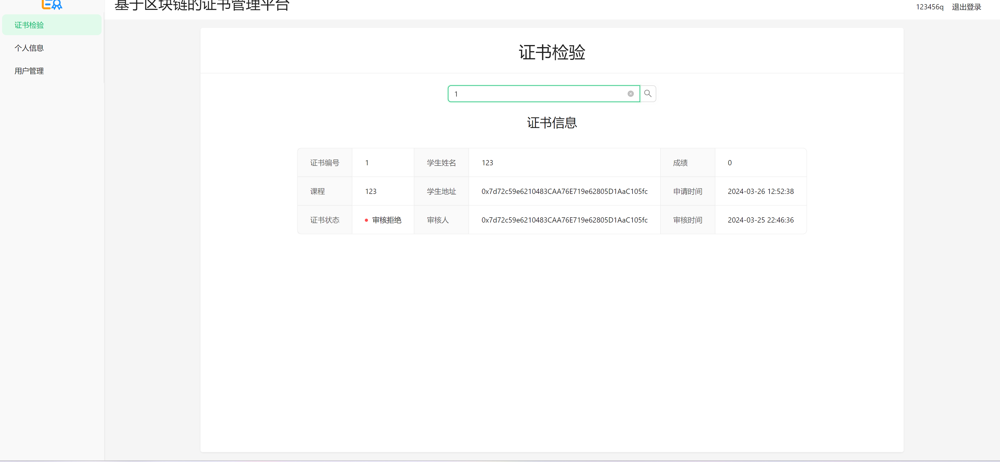

# 基于区块链的证书管理平台
# 运行
- 只写sql
- 先更新sdk证书
- 
- 
- 部署合约，把deply-contract 放到fisco服务器上
- 修改certificate-backend合约地址
- 修改.env 的数据库地址
- 
- 在fisco服务器上运行后端 certificate-backend，
- 修改前端文件的代理地址
- 
- 运行前端certificate-ui
# 技术栈
## 后端
- fisco
- solidity
- golang
- mysql
- gin
- gorm
## 前端
- react
- antd
- antdpro
- axios
- unocss
- react-router-dom
- zustand
# 功能
## 用户管理
管理员：admin 123456789
### 用户基本信息
- id
- 账号
- 呢称
- 密码
- 账号地址
- 账号私钥
- 角色 （学生 老师 管理员）
- 状态 （待审核 启用 禁用）
- 注册时间
### 用户注册
> 填写 账号 呢称 和密码 可选角色  老师 或者 学生
### 登陆
> 填写 账号 和密码

### 个人信息
- 修改呢称
- 修改密码
### 用户列表
> 管理员可看
> 展示当前系统的所有用户 
- 审核用户， （已拒绝的注册申请直接删除）
- 修改角色
- 修改状态

## 证书管理

### 证书基本信息
- id
- 学生姓名
- 成绩
- 课程
- 学生地址
- 申请时间
- 审核时间
- 证书状态 (待审核 审核通过 审核拒绝)
- 审核人
- 审核时间

### 证书核验
> 根据证书id查询合约，返回证书详情

### 我的证书列表
> 学生可见， 申请的证书列表 包含审核通过 和 审核拒绝的证书列表
- 申请证书 选择老师，提交证书
- 查看自己的证书

### 待审核的证书列表
> 老师可见
- 审核证书 

用户管理可以存储再mysql，只是证书要求是智能合约，你怎么方便怎么来，用户我想的是学生，老师，管理员，学生提交申请给老师，老师同意批准申请
界面中显示该用户的证书，就是说学生用户能够在证书列表界面列出他的所有证书

# 预览

